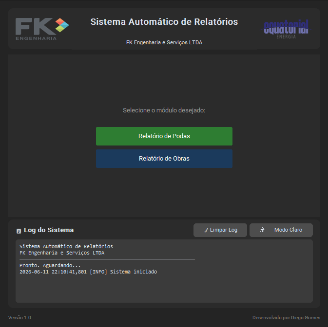

<div align="center">

# Sistema Automático de Relatorios

### FK Engenharia

Automação de relatorios tecnicos de Podas e Obras, Obras e consulta de Estruturas.

<br>



</div>

---

# Sobre o Projeto

Este projeto nasceu da necessidade de reduzir o tempo gasto na elaboração de relatórios técnicos utilizados diariamente em campo.

Durante a execução de serviços para a Equatorial Energia, grande parte do trabalho era consumida organizando fotografias, preenchendo documentos Word e montando evidências manualmente.

Com o objetivo de automatizar esse processo, foi desenvolvido este sistema em Python, capaz de organizar imagens, processar informações e gerar relatórios padronizados em poucos cliques.

O sistema foi criado inicialmente para relatórios de podas e posteriormente expandido para relatórios de obras e biblioteca de estruturas.

---

# Funcionalidades

### Relatório de Podas

- Organização automática das fotos
- Ordenação por data e horário
- Inserção automática em modelo Word
- Geração de relatório padronizado

### Relatório de Obras

- Organização automática por postes
- Processamento de evidências fotográficas
- Inserção automática em modelo Word
- Numeração e identificação de projetos

### Biblioteca de Materiais

- Consulta rápida de estruturas
- Visualização de planilhas Excel
- Pesquisa por código da estrutura
- Inclusão de novos materiais

---

# Tecnologias Utilizadas

- Python
- CustomTkinter
- Python-Docx
- Pillow
- Piexif
- OpenPyXL
- PyInstaller

---

# Objetivo

O principal objetivo deste projeto é automatizar atividades repetitivas realizadas na elaboração de relatórios técnicos, reduzindo erros operacionais e aumentando a produtividade da equipe.

Além da aplicação prática no ambiente de trabalho, o projeto também representa um processo de aprendizado e evolução na área de desenvolvimento de software porque eu ainda sou estudante.

---

# Inteligência Artificial

Este sistema contou com forte apoio de ferramentas de Inteligência Artificial durante seu desenvolvimento.

A Inteligência Artificial foi utilizada como apoio no desenvolvimento, auxiliando em pesquisas, correção de erros e implementação de funcionalidades, reduzindo significativamente o tempo necessário para concluir o projeto.

---

# Estrutura do Projeto

```text
SYSTEM/
│
├── assets/
├── modelo/
├── modules/
├── Mtrs_Estruturas/
├── relatorios_gerados/
│
├── sistema.py
├── config.json
└── sistema.spec
```

---

# Interface

O sistema possui interface gráfica desenvolvida em CustomTkinter com suporte a:

- Tema Claro
- Tema Escuro
- Logs em tempo real
- Navegação simplificada
- Distribuição por executável Windows

---

# Autor

**Diego/dege00**

Projeto desenvolvido para auxiliar a execução e documentação de serviços realizados pela FK Engenharia.

---

<div align="center">

 TERMINAL: pip install -r requirements.txt
 Desenvolvido com Python, estudo contínuo e muitas horas de café.

</div>
